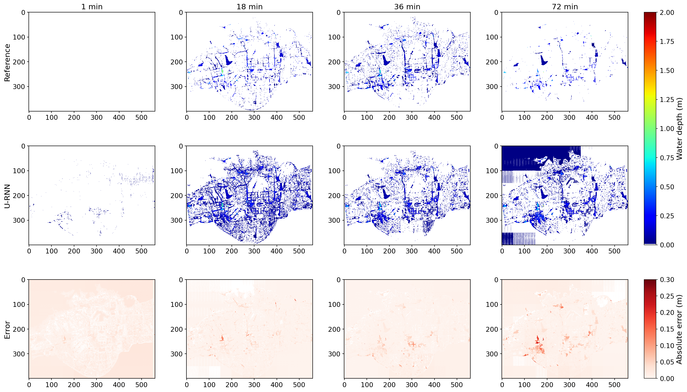

# [U-RNN: High-resolution Spatiotemporal Nowcasting of Urban Flooding](https://www.sciencedirect.com/science/article/pii/S002216942500455X?via%3Dihub)

<p align="center">
  <a href="https://www.sciencedirect.com/science/article/pii/S002216942500455X?via%3Dihub"></a>
  <a href="https://colab.research.google.com/github/holmescao/U-RNN/blob/main/notebooks/quickstart.ipynb"></a>
  <a href="https://github.com/holmescao/U-RNN"></a>
  <a href="https://holmescao.github.io/datasets/urbanflood24"></a>
  <a href="https://drive.google.com/file/d/1tfwRJ3gFFTa0kiziVeo9xXsz0DaaJrJU/view?usp=drive_link"></a>
  <a href="https://huggingface.co/holmescao/U-RNN"></a>
</p>

---

<p align="center"></p>
<p align="center"><em><strong>U-RNN vs. hydrodynamic solver — 100-year return-period rainfall event, location1.</strong> U-RNN delivers &gt;100× faster inference with high spatial accuracy at 2 m / 1 min resolution.</em></p>

---

> [](https://colab.research.google.com/github/holmescao/U-RNN/blob/main/notebooks/quickstart.ipynb)
> &nbsp; **Quickest path** — run the full pipeline in your browser in < 5 min. No GPU, no data download, no local setup.

> 🚀 **Prefer a cloud GPU for full-resolution training?**
> Rent a single RTX 4090 on [AutoDL](https://www.autodl.com/) for ~¥2/hour. A complete step-by-step guide using the browser-based JupyterLab is in [Section 11 — Cloud GPU: AutoDL Guide](#11-cloud-gpu--autodl-guide).

---

## News

- **[2026.03]** [](https://colab.research.google.com/github/holmescao/U-RNN/blob/main/notebooks/quickstart.ipynb) **Quickstart notebook released** — reproduce flood nowcasting in < 5 minutes, no local GPU or dataset needed.
- **[2026.03]** **[LarNO](https://github.com/holmescao/LarNO) benchmark datasets supported**: train on [Futian](configs/futian_scratch.yaml) (Shenzhen, 20 m/5 min) and [UKEA](configs/ukea_scratch.yaml) (UK, 8 m/5 min). See [Section 6](#6-scenario-c--larno-datasets-training-futian--ukea).
- **[2026.03]** Training speedup tips added: use the lightweight dataset (8 m / 10 min) for fast iteration — see [Section 5](#5-scenario-b--lightweight-training-fast-iteration).
- **[2025.04]** Peking University's official media promoted our work — [Chinese](https://mp.weixin.qq.com/s/hbeWwhh_j46FiBgSIPL_jw) | [English](https://see.pkusz.edu.cn/en/info/1007/1156.htm).
- **[2025.04]** Paper online at [ScienceDirect](https://www.sciencedirect.com/science/article/pii/S002216942500455X?via%3Dihub).
- **[2025.03]** U-RNN accepted by *Journal of Hydrology*.
- **[2024.12]** UrbanFlood24 dataset publicly released at [official project page](https://holmescao.github.io/datasets/urbanflood24) and [Baidu Cloud (code: urnn)](https://pan.baidu.com/s/1WCLdgWvT2MsQxpd_hsTGPA).

---

<p align="center"></p>
<p align="center"><em><strong>U-RNN architecture.</strong> A U-like Encoder-Decoder with multi-scale ConvGRU cells processes spatiotemporal rainfall + terrain inputs. The Sliding Window-based Pre-warming (SWP) paradigm decomposes long sequences into overlapping windows for memory-efficient training.</em></p>

---

## Quick Start

<div align="center">

| | |
|:---:|:---|
| [](https://colab.research.google.com/github/holmescao/U-RNN/blob/main/notebooks/quickstart.ipynb) | **No local GPU? Try in your browser.** The [quickstart notebook](notebooks/quickstart.ipynb) runs end-to-end in < 5 min — no installation, no dataset download. Covers architecture demo, real inference, and a training run. |

</div>

Or run locally in **3 commands**:

```bash
# 1. Clone & install
git clone https://github.com/holmescao/U-RNN && cd U-RNN/code
pip install torch==2.0.0 torchvision==0.15.1 --index-url https://download.pytorch.org/whl/cu118
pip install -r requirements.txt

# 2. Download pre-trained weights (see Section 3) and dataset (see Section 2), then:

# 3. Run inference — results in exp/20240202_162801_962166/figs/
python test.py --exp_config configs/location1_scratch.yaml --timestamp 20240202_162801_962166
# Or use a lightweight checkpoint (see Section 3 for all available checkpoints)
python test.py --exp_config configs/lite.yaml --timestamp 20260316_130418_443889
```

---

## Table of Contents

1. [Installation](#1-installation)
2. [Dataset Preparation](#2-dataset-preparation)
3. [Pre-trained Weights](#3-pre-trained-weights)
4. [Scenario A — Quick Inference with Pre-trained Weights](#4-scenario-a--quick-inference-with-pre-trained-weights)
5. [Scenario B — Lightweight Training (Fast Iteration)](#5-scenario-b--lightweight-training-fast-iteration)
6. [Scenario C — LarNO Datasets Training (Futian & UKEA)](#6-scenario-c--larno-datasets-training-futian--ukea)
7. [Scenario D — Full Training (Paper Results)](#7-scenario-d--full-training-paper-results)
8. [Inference with TensorRT (Optional)](#8-inference-with-tensorrt-optional)
9. [Project Structure](#9-project-structure)
10. [Outputs](#10-outputs)
11. [Cloud GPU — AutoDL Guide](#11-cloud-gpu--autodl-guide)
12. [License](#12-license)
13. [FAQ](#13-faq)
14. [Citation](#14-citation)
15. [Contributing](#15-contributing)

---

## 1. Installation

💻 **Step 1 — Clone the repository**

```bash
git clone https://github.com/holmescao/U-RNN
cd code
```

💻 **Step 2 — Create a conda environment**

```bash
conda create -n urnn python=3.8
conda activate urnn
```

💻 **Step 3 — Install PyTorch**

Install **PyTorch 2.0.0 with CUDA 11.8** (tested on NVIDIA RTX 4090):

```bash
pip install torch==2.0.0 torchvision==0.15.1 torchaudio==2.0.1 \
    --index-url https://download.pytorch.org/whl/cu118
```

> 🇨🇳 China users — add the Tsinghua mirror for faster pip downloads (PyTorch must still be installed from the official wheel URL above):
> ```bash
> pip install -r requirements.txt -i https://pypi.tuna.tsinghua.edu.cn/simple
> ```

💻 **Step 4 — Install project dependencies**

```bash
cd code   # the inner code directory
pip install -r requirements.txt
```

> 📦 **Alternative — install as a package:**
> ```bash
> pip install -e .   # editable install from pyproject.toml
> ```
> This makes `urnn-train` and `urnn-test` available as CLI commands.

> **TensorRT inference (optional):** also run `pip install -r requirements_tensorrt.txt` — only needed for Section 8.

✅ **Step 5 — Verify the installation**

```bash
python -c "import torch; print(torch.__version__, torch.cuda.is_available())"
# Expected: 2.0.0+cu118 True
```

> **Other CUDA versions** — other PyTorch + CUDA combinations will also work; check [pytorch.org](https://pytorch.org/get-started/locally/) for the matching install command.

---

## 2. Dataset Preparation

### Supported Datasets

U-RNN supports training on three dataset sources:

| Dataset | From | Location | Resolution | Grid | Steps | Duration | Rainfall |
|---|---|---|---|---|---|---|---|
| **UrbanFlood24** | [U-RNN paper](https://www.sciencedirect.com/science/article/pii/S002216942500455X?via%3Dihub) | China (3 catchments) | 2 m / 1 min | 500×500 | 360 | 6 h | Uniform `(T,)` |
| **UrbanFlood24 Lite** | U-RNN paper (downsampled) | China (3 catchments) | 8 m / 10 min | 128×128 | 36 | 6 h | Uniform `(T,)` |
| **Futian** | [LarNO paper](https://holmescao.github.io/datasets/LarNO) | Shenzhen, China | 20 m / 5 min | 400×560 | 72 | 6 h | Spatial `(T,H,W)` |
| **UKEA** | [LarNO paper](https://holmescao.github.io/datasets/LarNO) | UK | 8 m / 5 min | 52×120 | 36 | 3 h | Spatial `(T,H,W)` |

---

### Dataset 1 — UrbanFlood24 (U-RNN paper, full resolution)

> Official page: [https://holmescao.github.io/datasets/urbanflood24](https://holmescao.github.io/datasets/urbanflood24)

This is the primary dataset from the U-RNN paper. It contains design-storm flood simulations for **3 urbanised catchments** (location1–3) in China, generated by the MIKE+ hydrodynamic solver at 2 m / 1 min resolution.

**Download:**

| Mirror | Link |
|---|---|
| Official page | [https://holmescao.github.io/datasets/urbanflood24](https://holmescao.github.io/datasets/urbanflood24) |
| Baidu Cloud (code: `urnn`) | [Download](https://pan.baidu.com/s/1WCLdgWvT2MsQxpd_hsTGPA) |

> ⚠️ The full dataset is **~115 GB**. If storage or GPU memory is limited, use UrbanFlood24 Lite (see below) or Scenario B for fast iteration.

**Placement:**

Unzip and place the data under `<U-RNN_HOME>/data/`:

```
U-RNN/
├── data/
│   └── urbanflood24/
│       ├── train/
│       │   ├── flood/
│       │   │   ├── location1/
│       │   │   │   ├── r100y_p0.5_d3h/
│       │   │   │   │   ├── flood.npy
│       │   │   │   │   └── rainfall.npy
│       │   │   │   └── ...
│       │   │   ├── location2/
│       │   │   └── location3/
│       │   └── geodata/
│       │       ├── location1/
│       │       │   ├── absolute_DEM.npy
│       │       │   ├── impervious.npy
│       │       │   └── manhole.npy
│       │       ├── location2/
│       │       └── location3/
│       └── test/
│           └── ...  (same structure)
└── code/   ← run all scripts from here
```

---

### Dataset 2 — UrbanFlood24 Lite (lightweight, recommended for fast iteration)

This is a **downsampled version** of UrbanFlood24 (spatial factor 4×, temporal factor 10×): 500×500→128×128, 360→36 steps. It is ~50× smaller and trains in **~30 min** on a single RTX 4090 while achieving **R²=0.989**.

**Download** (contains only the 12 training/test events for location1–3):

| Mirror | Link |
|---|---|
| Google Drive | [Download (no password)](https://drive.google.com/file/d/1_P4tNlYCneCmKr2X9r-TAoiCKk1-AauI/view?usp=sharing) |
| Baidu Cloud (code: `urnn`) | [Download](https://pan.baidu.com/s/1ooBkobt_IxbhU9c-rJ2eug?pwd=urnn) |

**Placement:** same structure as UrbanFlood24, under `data/urbanflood24_lite/`.

---

### Dataset 3 — Futian & UKEA ([LarNO](https://github.com/holmescao/LarNO) paper)

> Official page: [https://holmescao.github.io/datasets/LarNO](https://holmescao.github.io/datasets/LarNO)

These datasets originate from the [LarNO benchmark](https://github.com/holmescao/LarNO):
- **Futian** — Shenzhen urban catchment (20 m / 5 min, 400×560, spatial rainfall); location name: `region1`
- **UKEA** — UK catchment (8 m / 5 min, 52×120, spatial design storms); location name: `ukea`

**Download from the [official LarNO page](https://holmescao.github.io/datasets/LarNO)** — 4 mirrors available: Hugging Face, Google Drive, Baidu Cloud, Figshare.

After downloading, convert to U-RNN format:

```bash
cd code   # the inner code directory

# Convert Futian (Shenzhen, China) — location name in output: region1
python tools/convert_larfno_data.py --dataset futian \
    --larfno_root /path/to/larfno/futian \
    --dst_root    ../data/larfno_futian

# Convert UKEA (UK) — location name in output: ukea
python tools/convert_larfno_data.py --dataset ukea \
    --larfno_root /path/to/larfno/ukea \
    --dst_root    ../data/ukea_8m_5min
```

---

### File Format

| File | Shape | Unit | Description |
|---|---|---|---|
| `flood.npy` | `(T, H, W)` | metres | Ground-truth water depth from MIKE+ (converted to mm internally). |
| `rainfall.npy` | `(T,)` or `(T, H, W)` | mm / step | Rainfall intensity per time step. Scalar `(T,)` for UrbanFlood24; spatial `(T, H, W)` for Futian / UKEA. |
| `absolute_DEM.npy` | `(H, W)` | metres | Digital Elevation Model (terrain + buildings). |
| `impervious.npy` | `(H, W)` | fraction [0, 1] | Impervious surface ratio. |
| `manhole.npy` | `(H, W)` | {0, 1} | Drainage manhole locations. |

### Event Lists

Training and test events are listed in plain text files under `src/lib/dataset/`:

| File | Dataset | Events |
|---|---|---|
| `train.txt` / `test.txt` | UrbanFlood24 (all locations) | 36 train / 12 test |
| `location1_train.txt` / `location1_test.txt` | UrbanFlood24 location1 | 8 train / 4 test |
| `location2_train.txt` / `location2_test.txt` | UrbanFlood24 location2 | 8 train / 4 test |
| `location3_train.txt` / `location3_test.txt` | UrbanFlood24 location3 | 8 train / 4 test |
| `futian_train.txt` / `futian_test.txt` | Futian | 4 train / 4 test |
| `ukea_train.txt` / `ukea_test.txt` | UKEA | 8 train / 12 test |

---

## 3. Pre-trained Weights

We provide pre-trained checkpoints for all supported datasets.

| Checkpoint | Dataset | Grid | Epochs | R² | Size |
|---|---|---|---|---|---|
| **Location1 full-res** ⭐ | UrbanFlood24 location1 | 500×500 | 1000 | paper accuracy | ~300 MB |
| **Location1 lite** | UrbanFlood24 Lite location1 | 128×128 | 200 | 0.989 | ~20 MB |
| **Futian** | Futian (Shenzhen) | 400×560 | 200 | 0.888 | ~141 MB |
| **UKEA** | UKEA (UK) | 52×120 | 300 | 0.896 | ~11 MB |

### Location1 full-res (500×500, paper accuracy)

| Mirror | Link |
|---|---|
| Google Drive | [Download (no password)](https://drive.google.com/file/d/1tfwRJ3gFFTa0kiziVeo9xXsz0DaaJrJU/view?usp=drive_link) |
| Baidu Cloud (code: `urnn`) | [Download](https://pan.baidu.com/s/1lIkKNMZy2GQqKmYCATtw1w) |
| 🤗 Hugging Face Hub | Not included (full-res weights are very large; use Google Drive above) |

### Location1 lite (128×128)

| Mirror | Link |
|---|---|
| Google Drive | [Download (no password)](https://drive.google.com/file/d/1ehvXWkLBMoa4Jvf4l_KtM734ZIaw_7DK/view?usp=sharing) |
| Baidu Cloud (code: `urnn`) | [Download](https://pan.baidu.com/s/1O2vRXe0HJ3iH3LaPBmzpPw?pwd=urnn) |
| 🤗 Hugging Face Hub | [Download](https://huggingface.co/holmescao/U-RNN/resolve/main/checkpoints/loc1_lite_weights.zip) |

### Futian — Shenzhen (400×560)

| Mirror | Link |
|---|---|
| Google Drive | [Download (no password)](https://drive.google.com/file/d/1jynGk6wbufjJpDV8sKhWu-sixKZ-ehDr/view?usp=sharing) |
| Baidu Cloud (code: `urnn`) | [Download](https://pan.baidu.com/s/1mV4RXSKyj7G3zmUQMHK5HQ?pwd=urnn) |
| 🤗 Hugging Face Hub | [Download](https://huggingface.co/holmescao/U-RNN/resolve/main/checkpoints/futian_weights.zip) |

### UKEA — UK (52×120)

| Mirror | Link |
|---|---|
| Google Drive | [Download (no password)](https://drive.google.com/file/d/1MuKPjLNvrE7_s_leO5uH4SVmQL4ebcA1/view?usp=sharing) |
| Baidu Cloud (code: `urnn`) | [Download](https://pan.baidu.com/s/1vuZLXU_a__6rYeq66YxN7Q?pwd=urnn) |
| 🤗 Hugging Face Hub | [Download](https://huggingface.co/holmescao/U-RNN/resolve/main/checkpoints/ukea_weights.zip) |

### Placement

Each archive follows the same `exp/<timestamp>/save_model/` structure. Extract and place as shown:

```
U-RNN/
└── exp/
    ├── 20240202_162801_962166/       ← location1 full-res
    │   └── save_model/
    │       └── checkpoint_939_0.000205376.pth.tar
    ├── 20260316_130418_443889/       ← location1 lite
    │   └── save_model/
    │       └── checkpoint_143_0.065581453.pth.tar
    ├── 20260316_134929_015563/       ← Futian
    │   └── save_model/
    │       └── checkpoint_198_0.112292888.pth.tar
    └── 20260316_153558_270657/       ← UKEA
        └── save_model/
            └── checkpoint_181_0.132711639.pth.tar
```

Pass the corresponding `--timestamp` when running inference:

```bash
# Location1 full-res (Scenario A)
python test.py --exp_config configs/location1_scratch.yaml --timestamp 20240202_162801_962166

# Location1 lite
python test.py --exp_config configs/lite.yaml --timestamp 20260316_130418_443889

# Futian
python test.py --exp_config configs/futian_scratch.yaml --timestamp 20260316_134929_015563

# UKEA
python test.py --exp_config configs/ukea_scratch.yaml --timestamp 20260316_153558_270657
```

---

## 4. Scenario A — Quick Inference with Pre-trained Weights

> **Requirements:** pre-trained weights (Section 3) + corresponding dataset (Section 2) &nbsp;|&nbsp; any GPU &nbsp;|&nbsp; ~5 min

```bash
cd code   # the inner code directory

# Location1 full-res (UrbanFlood24, 500×500)
python test.py --exp_config configs/location1_scratch.yaml --timestamp 20240202_162801_962166

# Location1 lite (UrbanFlood24 Lite, 128×128)
python test.py --exp_config configs/lite.yaml          --timestamp 20260316_130418_443889

# Futian (Shenzhen, 400×560)
python test.py --exp_config configs/futian_scratch.yaml --timestamp 20260316_134929_015563

# UKEA (UK, 52×120)
python test.py --exp_config configs/ukea_scratch.yaml  --timestamp 20260316_153558_270657
```

### Visualizations

For each test event, `test.py` saves a **3-row comparison figure** to `exp/<timestamp>/figs/epoch@<N>/<event>/water_depth_spatial_temporal.png`:

<p align="center"></p>

| Row | Content | Colorbar |
|---|---|---|
| Reference | Ground-truth water depth (MIKE+) | 0–2 m (jet) |
| U-RNN | Model prediction | 0–2 m (jet) |
| Error | Absolute error \|pred − ref\| | 0–0.3 m (Reds) |

Time snapshots are configurable via `--viz_time_points` (space-separated zero-indexed integers).

### TensorRT acceleration (optional)

For ~2–3× faster inference, see [Section 8 — Inference with TensorRT](#8-inference-with-tensorrt-optional).

---

## 5. Scenario B — Lightweight Training (Fast Iteration)

> **Requirements:** UrbanFlood24 Lite dataset (Section 2) &nbsp;|&nbsp; ≥ 8 GB VRAM &nbsp;|&nbsp; ~30 min on RTX 4090 (200 epochs)

This scenario trains on the **128×128 × 36 steps** lightweight dataset (~50× smaller than full resolution). It is the recommended starting point for verifying your setup before committing to full training.

### UrbanFlood24 Lite

Download the lite dataset (Section 2), then:

```bash
cd code   # the inner code directory
python main.py --exp_config configs/lite.yaml
```

### Multi-GPU (DDP via torchrun)

```bash
CUDA_VISIBLE_DEVICES=0,1 torchrun --nproc_per_node=2 main.py \
    --exp_config configs/lite.yaml
```

> DDP gradients are averaged automatically across GPUs; effective batch size = `batch_size × world_size`. Linux only (NCCL backend). On Windows use single-GPU.

### Outputs

The script creates `exp/<timestamp>/` with:

```
exp/<timestamp>/
├── save_model/     ← model checkpoints (.pth.tar)
├── save_train_loss/
├── save_res_data/
└── figs/           ← test visualizations (if test: true in config)
```

Note the generated `<timestamp>` — you will need it to run inference on your own trained model:

```bash
python test.py --exp_config configs/lite.yaml \
               --timestamp  <your_timestamp>
```

---

## 6. Scenario C — LarNO Datasets Training (Futian & UKEA)

> **Requirements:** LarNO dataset (Section 2) &nbsp;|&nbsp; ≥ 8–16 GB VRAM &nbsp;|&nbsp; 40 min – 12 h on RTX 4090

### Futian (Shenzhen, China)

> ~6–12 h on RTX 4090 (200 epochs, 400×560 grid)

```bash
cd code   # the inner code directory

# First convert the LarNO dataset (one-time):
python tools/convert_larfno_data.py --dataset futian \
    --larfno_root /path/to/larfno/futian \
    --dst_root    ../data/larfno_futian

# Train:
python main.py --exp_config configs/futian_scratch.yaml
```

### UKEA (UK)

> ~40–80 min on RTX 4090 (300 epochs, 52×120 grid)

```bash
# First convert the LarNO dataset (one-time):
python tools/convert_larfno_data.py --dataset ukea \
    --larfno_root /path/to/larfno/ukea \
    --dst_root    ../data/ukea_8m_5min

# Train:
python main.py --exp_config configs/ukea_scratch.yaml
```

### Multi-GPU (DDP via torchrun)

```bash
CUDA_VISIBLE_DEVICES=0,1 torchrun --nproc_per_node=2 main.py \
    --exp_config configs/futian_scratch.yaml
```

> DDP gradients are averaged automatically across GPUs; effective batch size = `batch_size × world_size`. Linux only (NCCL backend). On Windows use single-GPU.

---

## 7. Scenario D — Full Training (Paper Results)

> **Requirements:** full UrbanFlood24 dataset (Section 2) &nbsp;|&nbsp; ≥ 16 GB VRAM per location &nbsp;|&nbsp; ~6–12 h per location on RTX 4090 (1000 epochs)

U-RNN trains on **one location at a time**. To reproduce paper results, train each location separately:

```bash
cd code   # the inner code directory

python main.py --exp_config configs/location1_scratch.yaml
python main.py --exp_config configs/location2_scratch.yaml
python main.py --exp_config configs/location3_scratch.yaml
```

### Multi-GPU (DDP via torchrun)

```bash
CUDA_VISIBLE_DEVICES=0,1 torchrun --nproc_per_node=2 main.py \
    --exp_config configs/location1_scratch.yaml
```

### Inference on your trained model

```bash
python test.py --exp_config configs/location1_scratch.yaml \
               --timestamp  <your_timestamp>
```

---

## 8. Inference with TensorRT (Optional)

TensorRT accelerates inference by ~2–3× over PyTorch on the same GPU. This requires [TensorRT 10.0.0.6](https://developer.nvidia.com/tensorrt).

### Step 1 — Convert the model

```bash
python urnn_to_tensorrt.py --exp_config configs/location1_scratch.yaml \
                           --timestamp 20240202_162801_962166
```

This creates `exp/<timestamp>/tensorrt/URNN.trt`.

### Step 2 — Run TensorRT inference

```bash
python test.py --exp_config configs/location1_scratch.yaml \
               --timestamp  20240202_162801_962166 --trt
```

---

## 9. Project Structure

```
U-RNN/
├── data/                               ← populate after downloading
│   └── urbanflood24/
│       ├── train/
│       │   ├── flood/<location>/<event>/
│       │   │   ├── flood.npy           (T, H, W) metres
│       │   │   └── rainfall.npy        (T,) or (T, H, W) mm/step
│       │   └── geodata/<location>/
│       │       ├── absolute_DEM.npy    (H, W) metres
│       │       ├── impervious.npy      (H, W) fraction
│       │       └── manhole.npy         (H, W) binary
│       └── test/                       ← same structure
│
├── exp/                                ← auto-created during training
│   └── <timestamp>/
│       ├── save_model/                 ← checkpoints (.pth.tar)
│       ├── save_train_loss/
│       ├── save_res_data/
│       └── figs/epoch@<N>/            ← inference visualizations (PNG)
│
└── code/                               ← run all scripts from here
    ├── main.py                         ← training entry point
    ├── test.py                         ← inference entry point
    ├── config.py                       ← all hyperparameters (argparse + YAML)
    ├── pyproject.toml                  ← package definition (pip install -e .)
    ├── urnn_to_tensorrt.py             ← PyTorch → TensorRT conversion
    ├── requirements.txt
    ├── notebooks/
    │   └── quickstart.ipynb            ← Colab quickstart notebook
    ├── configs/
    │   ├── lite.yaml               ← lightweight UrbanFlood24 (recommended start) ⭐
    │   ├── location1_scratch.yaml  ← UrbanFlood24 location1 from scratch
    │   ├── location2_scratch.yaml  ← UrbanFlood24 location2 from scratch
    │   ├── location3_scratch.yaml  ← UrbanFlood24 location3 from scratch
    │   ├── futian_scratch.yaml     ← Futian (Shenzhen) from scratch
    │   ├── ukea_scratch.yaml       ← UKEA (UK) from scratch
    │   ├── network.yaml            ← model architecture shapes (rarely changed)
    │   ├── defaults/               ← internal defaults (do not edit)
    │   │   ├── training.yaml
    │   │   └── data.yaml
    │   └── experiments/            ← ablation / research configs (not for general use)
    ├── tools/
    │   ├── downsample_dataset.py       ← lightweight dataset generator
    │   ├── convert_larfno_data.py      ← LarNO → U-RNN format converter
    │   └── compare_metrics.py          ← U-RNN vs baseline metrics comparison
    │
    └── src/lib/
        ├── dataset/
        │   ├── Dynamic2DFlood.py       ← data loading (supports scalar + spatial rain)
        │   ├── train.txt               ← UrbanFlood24 training event list (all locations)
        │   ├── test.txt                ← UrbanFlood24 test event list (all locations)
        │   ├── location1_train.txt / location1_test.txt
        │   ├── location2_train.txt / location2_test.txt
        │   ├── location3_train.txt / location3_test.txt
        │   ├── futian_train.txt / futian_test.txt
        │   └── ukea_train.txt / ukea_test.txt
        ├── model/
        │   ├── networks/
        │   │   ├── model.py            ← ED (Encoder-Decoder) architecture
        │   │   ├── encoder.py          ← multi-scale encoder with ConvGRU
        │   │   ├── decoder.py          ← multi-scale decoder with ConvGRU
        │   │   ├── ConvRNN.py          ← ConvLSTM / ConvGRU cell
        │   │   ├── net_params.py       ← architecture configuration
        │   │   ├── losses.py           ← FocalBCE_and_WMSE loss
        │   │   └── head/flood_head.py  ← dual-output head (reg + cls)
        │   └── earlystopping.py
        └── utils/
            ├── distributed_utils.py    ← multi-GPU DDP utilities
            └── general.py
```

---

## 10. Outputs

### Training Logs

Training prints per-epoch loss and saves checkpoints to `exp/<timestamp>/save_model/`.

Example log line:
```
[ 939/1000] loss:0.000205376 | loss_reg:... | loss_cls:... | time:42.31 sec
```

### Inference Visualizations

For each test event, `test.py` saves a 3-row PNG to:

```
exp/<timestamp>/figs/epoch@<N>/
└── <event_name>/
    └── water_depth_spatial_temporal.png
```

**Figure layout:** Row 1 = Reference (ground truth), Row 2 = U-RNN prediction, Row 3 = Absolute error. Rows 1–2 share a fixed 0–2 m colorbar; Row 3 uses 0–0.3 m.

### Metrics

Per-event metrics (R², RMSE, MAE, CSI) are saved to `exp/<timestamp>/metrics/metrics_epoch<N>.xlsx`.

---

## 11. Cloud GPU — AutoDL Guide

If you do not have a local GPU, rent one from [AutoDL](https://www.autodl.com/) for approximately ¥1–3 per hour. The guide below uses the **browser-based JupyterLab** — no additional software needed on your local machine.

> ⚠️ **Download the dataset to your local machine first** (see [Section 2](#2-dataset-preparation)) before creating a cloud instance.

---

### 🖥️ Step 1 — Create a GPU instance

1. Register and log in at [https://www.autodl.com/](https://www.autodl.com/).
2. Click **租用 → GPU 云服务器**.
3. Choose a GPU with **≥ 24 GB VRAM** for the full dataset (e.g., RTX 4090 24 GB).
   - For the lightweight 8 m / 10 min dataset, **≥ 8 GB VRAM** is sufficient.
4. Select the base image: **PyTorch 2.0 → Python 3.8 (ubuntu20.04) → CUDA 11.8**.
5. Click **立即创建** and wait for the instance to start.

---

### 🌐 Step 2 — Open JupyterLab

On the instance overview page, click the **JupyterLab** button. Use the **terminal** (Launcher → Terminal) to run shell commands.

---

### 💻 Step 3 — Clone the repository

```bash
cd /root/autodl-tmp/
git clone https://github.com/holmescao/U-RNN
```

---

### 📥 Step 4 — Upload the dataset via SCP

Find your **SSH login command** on the AutoDL instance overview page, e.g.:

```
ssh -p 12345 root@connect.westb.seetacloud.com
```

> ⚠️ The host, port, and password above are **examples** — use your own dashboard values.

#### Linux / macOS

```bash
# Upload the dataset zip
scp -P 12345 /local/path/urbanflood24.zip root@connect.westb.seetacloud.com:/root/autodl-tmp/
# Or rsync for large folders (resumes on failure):
rsync -avz --progress -e "ssh -p 12345" /local/path/urbanflood24/ \
    root@connect.westb.seetacloud.com:/root/autodl-tmp/U-RNN/data/urbanflood24/
```

#### Windows (PowerShell)

```powershell
scp -P 12345 C:\path\to\urbanflood24.zip root@connect.westb.seetacloud.com:/root/autodl-tmp/
```

Or use [WinSCP](https://winscp.net/) with Protocol = SCP.

#### Unzip on the cloud instance

```bash
cd /root/autodl-tmp/
unzip urbanflood24.zip
mv urbanflood24 U-RNN/data/
ls U-RNN/data/urbanflood24/train/flood/    # verify
```

---

### ⚙️ Step 5 — Install dependencies

```bash
cd /root/autodl-tmp/U-RNN/code
pip install -r requirements.txt -i https://pypi.tuna.tsinghua.edu.cn/simple
```

---

### 📥 Step 6 — Upload pre-trained weights (required for Step 7; skip if going straight to Step 8)

```bash
# On your local machine:
scp -P 12345 /local/path/checkpoint_939_0.000205376.pth.tar \
    root@connect.westb.seetacloud.com:/root/autodl-tmp/U-RNN/exp/20240202_162801_962166/save_model/
```

---

### 🔍 Step 7 — Quick inference with pre-trained weights (Scenario A)

```bash
cd /root/autodl-tmp/U-RNN/code
python test.py \
    --exp_config configs/location1_scratch.yaml \
    --timestamp  20240202_162801_962166
```

Results appear in `exp/20240202_162801_962166/figs/`.

---

### 🏋️ Step 8 — Training

**Scenario B — UrbanFlood24 lightweight dataset (128×128×36, ~30 min on one 4090):**

```bash
cd /root/autodl-tmp/U-RNN/code
python main.py --exp_config configs/lite.yaml
```

**Scenario C — Futian (Shenzhen, 400×560×72, ~6–12 h on one 4090):**

```bash
cd /root/autodl-tmp/U-RNN/code

# First convert the LarNO dataset (one-time):
python tools/convert_larfno_data.py --dataset futian \
    --larfno_root /root/autodl-tmp/data/larfno_futian \
    --dst_root    ../data/larfno_futian

# Train:
python main.py --exp_config configs/futian_scratch.yaml
```

**Scenario C — UKEA (UK, 52×120×36, ~40–80 min on one 4090):**

```bash
cd /root/autodl-tmp/U-RNN/code

# First convert the LarNO dataset (one-time):
python tools/convert_larfno_data.py --dataset ukea \
    --larfno_root /root/autodl-tmp/data/larfno_ukea \
    --dst_root    ../data/ukea_8m_5min

# Train:
python main.py --exp_config configs/ukea_scratch.yaml
```

**Scenario D — Full-resolution per-location (500×500×360, ~6–12 h per location on one 4090):**

```bash
python main.py --exp_config configs/location1_scratch.yaml
python main.py --exp_config configs/location2_scratch.yaml
python main.py --exp_config configs/location3_scratch.yaml
```

---

### 💾 Step 9 — Download results

```bash
# On your local machine:
scp -P 12345 -r root@connect.westb.seetacloud.com:/root/autodl-tmp/U-RNN/exp/ \
    /local/path/results/
```

---

## 12. License

This project is released under the [MIT License](LICENSE).

---

## 13. FAQ

**Q: Which scenario should I start with?**

A: Follow this order:
1. **Scenario A** — run inference with the pre-trained weights to verify your setup (requires full dataset, ~5 min).
2. **Scenario B** — train on the lightweight dataset (~30 min) to confirm the training pipeline works end-to-end.
3. **Scenario C** — train on LarNO datasets (Futian or UKEA) with pre-converted data.
4. **Scenario D** — full training to reproduce paper accuracy (~40 hours).

---

**Q: Training is very slow. How can I speed it up?**

A: Three main levers:
1. **Reduce spatiotemporal resolution** — use `tools/downsample_dataset.py` to create a downsampled dataset. A 4× spatial + 10× temporal reduction gives ~50× speedup (Scenario B).
2. **Reduce epochs** — the paper uses 1000 epochs, but **200 epochs with `prewarming=false` achieves R²=0.989**, which is our recommended default.
3. **Enable gradient checkpointing** — add `--use_checkpoint` to reduce GPU memory and allow larger `--seq_num`.

---

**Q: I get CUDA out-of-memory during training. What can I do?**

A: Try any of the following:
- Add `--use_checkpoint` (gradient checkpointing; already enabled in experiment YAMLs).
- Reduce `--seq_num` (e.g., from 28 to 14) to shorten each backward pass.
- Use the lightweight dataset (Scenario B) to reduce input size.
- Reduce `--batch_size` (default is already 1).

---

**Q: What do I need to change when using my own dataset?**

A: You need to:
1. Prepare data files: `flood.npy` (T, H, W), `rainfall.npy` (T,) or (T, H, W), and geodata files.
2. Put them under `data/<your_dataset>/train/flood/<location>/` and `geodata/<location>/`.
3. Create event list files `src/lib/dataset/<your>_train.txt` and `<your>_test.txt`.
4. Copy an existing config (e.g., `configs/lite.yaml`) to `configs/custom.yaml` and update `data_root`, `input_height`, `input_width`, `window_size`, `duration`, and normalization constants.

---

**Q: How do I evaluate on a new location?**

A: Train the model from scratch for that location (providing matching `train.txt` / `test.txt`). The architecture parameters (filter sizes, number of stages) do not depend on location and can be reused. Only normalization constants may need tuning for significantly different rainfall regimes.

---

**Q: How do I run single-GPU vs multi-GPU training?**

A: The same `main.py` entry point supports both modes automatically:
- **Single GPU**: `python main.py --exp_config ...` — no launcher needed.
- **Multi-GPU (DDP)**: `torchrun --nproc_per_node=N main.py --exp_config ...` — `torchrun` sets `LOCAL_RANK`/`RANK`/`WORLD_SIZE` automatically.

Note: `python -m torch.distributed.launch` (deprecated since PyTorch 1.9) also still works.

---

**Q: Multi-GPU training doesn't work on Windows.**

A: The NCCL backend requires Linux. On Windows, use single-GPU (`python main.py ...`) or WSL2 for multi-GPU.

---

**Q: test.py says it can't find the checkpoint.**

A: The `--timestamp` must match exactly the directory name under `exp/`. Check that `exp/<timestamp>/save_model/` contains at least one `checkpoint_*.pth.tar` file.

---

**Q: How do I change the visualization time points?**

A: Pass `--viz_time_points 0 60 120 180` (space-separated integers, zero-indexed). Make sure all indices are within `[0, window_size - 1]`. For the lightweight dataset (36 steps), use `--viz_time_points 0 11 23 35`.

---

**Q: How do I use spatial (heterogeneous) rainfall?**

A: Store `rainfall.npy` as shape `(T, H, W)` instead of `(T,)`. The dataset loader detects the shape automatically — no config change needed. Futian and UKEA configs already use spatial rainfall.

---

## 14. Citation

If you find this project useful, please cite our paper and dataset:

```bibtex
@article{cao2025u,
  title={U-RNN high-resolution spatiotemporal nowcasting of urban flooding},
  author={Cao, Xiaoyan and Wang, Baoying and Yao, Yao and Zhang, Lin and Xing, Yanwen
          and Mao, Junqi and Zhang, Runqiao and Fu, Guangtao
          and Borthwick, Alistair GL and Qin, Huapeng},
  journal={Journal of Hydrology},
  pages={133117},
  year={2025},
  publisher={Elsevier}
}

@misc{cao2024supplementary,
  author    = {Cao, Xiaoyan and Wang, Baoying and Qin, Huapeng},
  title     = {Supplementary data of "U-RNN high-resolution spatiotemporal
               nowcasting of urban flooding"},
  year      = {2024},
  publisher = {figshare},
  note      = {Dataset}
}
```

---

## 15. Contributing

Contributions are welcome! See [CONTRIBUTING.md](CONTRIBUTING.md) for guidelines on bug reports, pull requests, and adding new datasets.

See [CHANGELOG.md](CHANGELOG.md) for the full history of changes.
