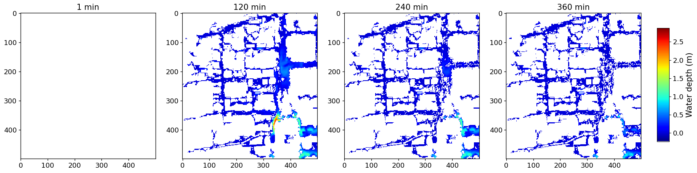

# (Journal of Hydrology 2025) U-RNN High-resolution spatiotemporal nowcasting of urban flooding

New Architecture for Spatiotemporal Forecasting!

- U-RNN, the first latent autoregressive architecture (verified on 2D hydrodynamics).
- SWP training paradigm is used to address large-scale spatiotemporal modeling challenges.

<p align="center"></p>

> [**U-RNN High-resolution spatiotemporal nowcasting of urban flooding**](https://papers.ssrn.com/sol3/papers.cfm?abstract_id=4935234)
>
> Xiaoyan Cao, et al.
>
> *[Preprint](https://papers.ssrn.com/sol3/papers.cfm?abstract_id=4935234)*


## News ✨
* (2025.03) U-RNN is accepted by Journal of Hydrology! 🎊🎊🎊
* (2024.12) We have released the proposed [urbanflood24](https://figshare.com/articles/dataset/Supplementary_data_of_U-RNN_high-resolution_spatiotemporal_nowcasting_of_urban_flooding_/28082549?file=51407804) dataset as a new benchmark.

## Abstract

With urban flood risk escalating due to climate change and rapid urbanization, there is a pressing need for fast, accurate, high-resolution spatiotemporal nowcasting flood flow simulations. Although deep learning (DL) methods hold great promise for providing such information, they nevertheless confront two main challenges: how to capture multi-scale nonlinear spatiotemporal interdependencies, and how to optimize long-sequence generalization with limited computational resources. Here we propose a novel U-like Recurrent Neural Network (U-RNN) to represent the spatiotemporal dynamic process of urban flooding, and a Sliding Window-based Pre-warming (SWP) training paradigm to reduce computational demand and enhance the generalization of full sequence predictions.  Case studies of four highly urbanized catchments in China and the United Kingdom, subjected to spatially uniform or variable rainfall events with return periods ranging from 0.1 to 500 years, demonstrate that U-RNN achieves high predictive accuracy in terms of flood extent, peak depth, and hydrograph, and accelerates 6-hour ahead nowcasts with by over 100 times when benchmarked against a state-of-the-art hydrodynamic model. The accuracy of our method also significantly outperforms the state-of-the-art DL method at high spatiotemporal resolution of order O(m) in space and O(min) in time. Results of the ablation study on U-RNN and parameter sensitivity analysis on SWP validate the effectiveness of each module.

## 0 Nowcasting performance

- Visualization of a measured rainfall forecast

<p align="center"></p>

- Quantitative evaluation on the test set

<p align="center"></p>

## 1 Installation

- Download the code repository.

```
git clone https://github.com/holmescao/U-RNN
```

- Install Python dependencies. (We use Python 3.8 and PyTorch 2.0.0 on a compatible NVIDIA GeForce RTX 4090).

```shell
conda create -n urnn python=3.8
conda activate urnn
pip install torch==2.0.0 torchvision==0.15.1 torchaudio==2.0.1 --index-url https://download.pytorch.org/whl/cu118
cd U-RNN # Into the code root directory
pip install -r requirements.txt -i https://pypi.tuna.tsinghua.edu.cn/simple
```

- Other required dependencies

  - CUDA 11.8

  - cuDNN 8.9.0

Note: other versions will also work, as long as the PyTorch, GPU, CUDA and cuDNN versions are compatible.

## 2 Data preparation

Download [urban flood dataset](https://figshare.com/articles/dataset/Supplementary_data_of_U-RNN_high-resolution_spatiotemporal_nowcasting_of_urban_flooding_/28082549?file=51407804) (note: it was uploaded to Figshare.com, and DOI will be available soon), unzip and put it into the path (`<U-RNN_HOME>/data`).

The dataset structure as follow:

```shell
data
└── urbanflood24
    ├── test
    │   └── flood
    │       └── location16
    │           ├── G1135_intensity_103
    │           │   ├── flood.npy
    │           │   └── rainfall.npy
	...
        └── geodata
            └── location16
                ├── absolute_DSM.npy
                ├── impervious.npy
                └── manhole.npy
    ...  
    └── train
        ├── flood
        │   └── location16
        │       ├── G1135_intensity_117
        │       │   ├── flood.npy
        │       │   └── rainfall.npy
	...
        └── geodata
            └── location16
                ├── absolute_DSM.npy
                ├── impervious.npy
                └── manhole.npy
    ...
```

## 3 Trained model weights

We provide the trained U-RNN [model weights](https://drive.google.com/file/d/1tfwRJ3gFFTa0kiziVeo9xXsz0DaaJrJU/view?usp=drive_link). Please download and put it into the path (`<U-RNN_HOME>/exp/20240202_162801_962166/save_model/checkpoint_939_0.000205376.pth.tar`).

## 4 (optional) Training 

Run the follow command in your terminal:

```shell
CUDA_VISIBLE_DEVICES=0 python -m torch.distributed.launch --nproc_per_node=1 main.py --device 0 --batch_size 1 --seq_num 28 --use_checkpoint
```

The root directory for the experimental result is in the path (`<U-RNN_HOME>/exp`). This script will generate a timestamp as the experiment name and create a folder for saving related files, for example, `<U-RNN_HOME>/exp/20240202_162801_962166`.

## 5 Inference

- First, open `test.py`, locate the next line of `if __name__ == "__main__":`, and set the `timestamp` variable value to the experiment name of your trained model, e.g., `timestamp=20240202_162801_962166`.

- Then, run the follow command in your terminal:

```shell
python test.py
```

The results will be saved in the path (`<U-RNN_HOME>/exp/<your_expr_name>/figs/`). For each rainfall event you will obtain a visualization of the inference results, as shown below:

<p align="center"></p>

## 6 (optional) Inference using TensorRT

- Convert the model from PyTorch to TensorRT. (We use [TensorRT 10.0.0.6](https://developer.nvidia.com/tensorrt)).
  - First, open `urnn_to_tensorrt.py`, locate the next line of `if __name__ == "__main__":`, and set the `timestamp` variable value to the experiment name of your trained model, e.g., `timestamp=20240202_162801_962166`.
  - Then, run the follow command in your terminal:


```shell
python urnn_to_tensorrt.py
```

You will get a TensorRT model `URNN.trt` in the path (`<U-RNN_HOME>/exp/<your_expr_name>/tensorrt/`) .

- Inference using TensorRT

```shell
python test.py --trt
```

The results will be saved in the path (`<U-RNN_HOME>/exp/<your_expr_name>/figs/`) .


## 7 Citation
If you find this project useful, please consider to cite our paper. Thank you!

```
@article{cao4935234u,
  title={U-Rnn High-Resolution Spatiotemporal Nowcasting of Urban Flooding},
  author={Cao, Xiaoyan and Wang, Baoying and Yao, Yao and Zhang, Lin and Xing, Yanwen and Mao, Junqi and Zhang, Runqiao and Fu, Guangtao and Borthwick, Alistair GL and Qin, Huapeng},
  journal={Available at SSRN 4935234}
}
```
